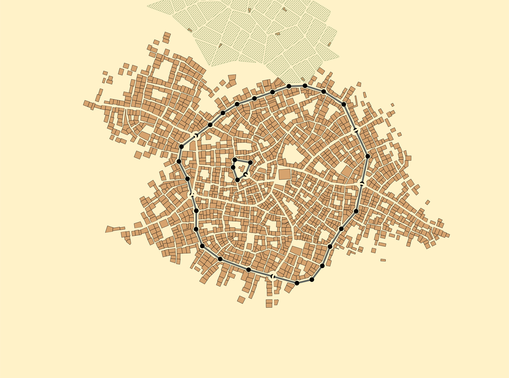
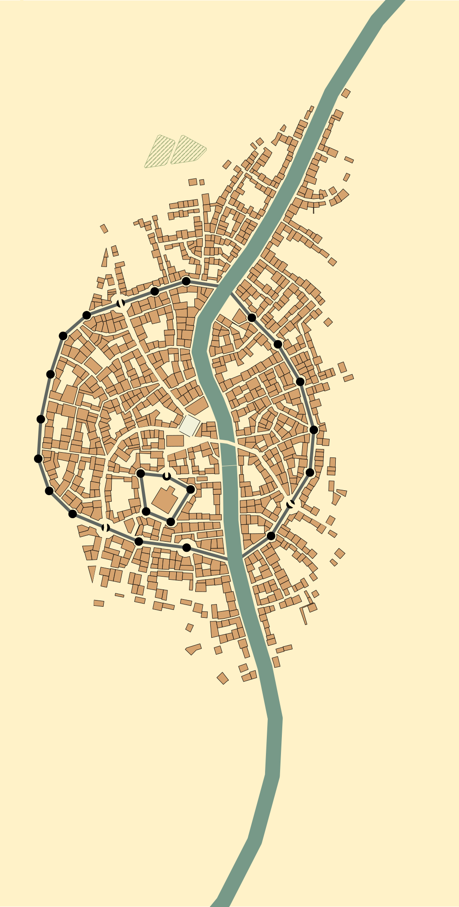
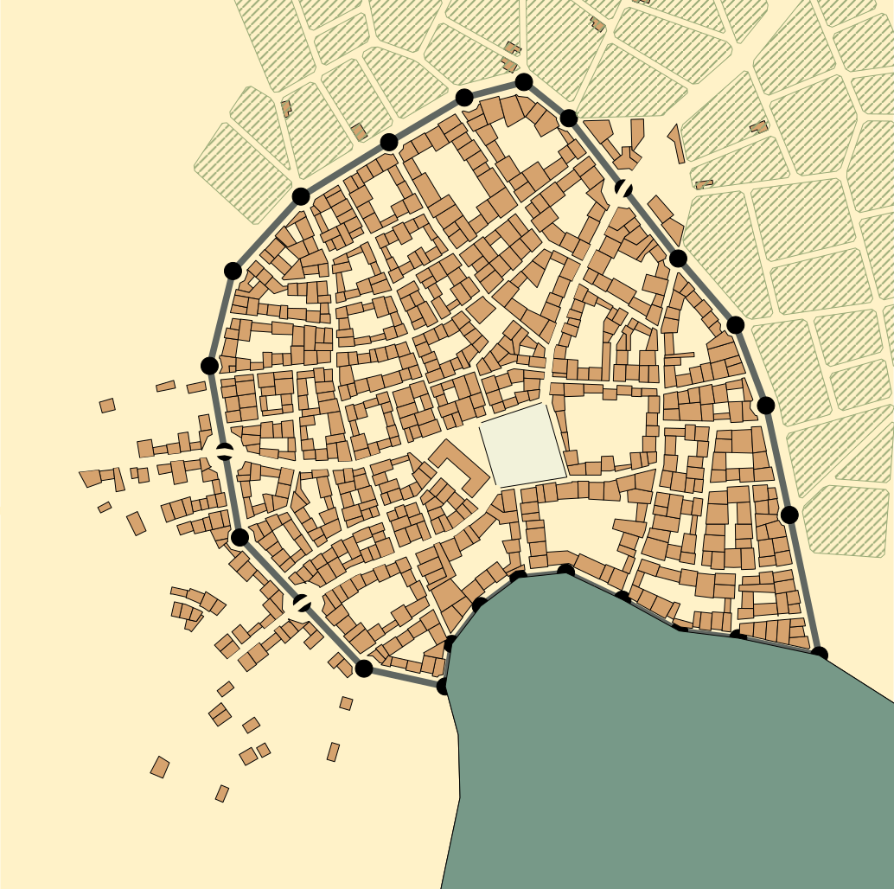

# GeoJson
Creates the svg maps based on data given in JSON file

###Requirments
 ~ python version 3.10 minimum

 ~ chevron

    pip install chevron
##What does it do?
Generates maps from JSON files(examples are in folder `/examples`). Maps are saved in .svg format

##How to run?
```bash
 python3 main.py full_path_to_the_folder_with_json_files
 ```
####How it looks like


